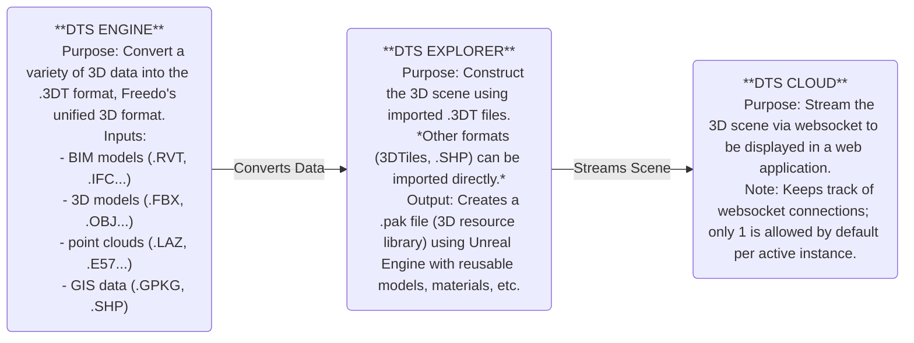

<h1 align="center">
  <a href="#"> Digital Twin Project Template for React.js</a>
</h1>

<p align="center">
  <a href="https://github.com/DanielTangCertis/DTS_Template/commits/react/">
    
  </a>
  <a href="https://github.com/DanielTangCertis/">
    
  </a>
</p>

<h4 align="center"> 
	 Status: Development Ongoing
</h4>

<p align="center">
 <a href="#about">About</a> •
 <a href="#pre-requisites">Pre-requisites</a> •
 <a href="#how-it-works">How it works</a> • 
 <a href="#tech-stack">Tech Stack</a> • 
 <a href="#project-structure">Project Structure</a> • 
 <a href="#others">Others</a>
</p>

## About

This repo should be used as a base for future Digital Twin Projects. It integrates the 3D Digital Twin Layer with the 2D UI Layer, and includes:
- Dashboard overlays done primarily using React+Typescript, MUI, NivoCharts.
- Configuration scripts (ac.min.js,ac_conf.js) for using Freedo's DTS Products (Explorer, Cloud, SDK)
- Hooks for calling Freedo SDK APIs (for controlling the 3D Layer via the 2D Layer) as well as external services like weather

---

## Pre-requisites

Before you begin, you will need to have the following tools installed on your machine:
[Git] (https://git-scm.com), [Node.js] (https://nodejs.org/en/).
If you already have Node.js installed previously, ensure Node Package Manager (npm) is up-to-date by running the following command:
```
npm install -g npm
```
In addition, it is good to have an editor such as [VSCode](https://code.visualstudio.com/)
with checkers/formatters like [ESLint](https://eslint.org/) and [Prettier](https://marketplace.visualstudio.com/items?itemName=esbenp.prettier-vscode) installed.

---

## How it works
### PREPARING THE DIGITAL TWIN 3D SCENE                                     

### RUNNING THE DIGITAL TWIN APPLICATION
STEP 1: Set up the project on your machine
```
# Clone this repository
$ git clone git@github.com: DanielTangCertis / DTS_Template.git

# Access the project folder in your terminal
$ cd DTS_Template

# Install the dependencies
$ npm i
```

STEP 2: Start the DTS Cloud service
The DTS Cloud service streams the selected DTS Explorer project (.acp format) by exposing the host IP and Port specified in the DTS Cloud Console.
The project .acp file must be available on the same machine where the DTS Cloud service is running.
> [!IMPORTANT]
> The host IP and Port specified on DTS Cloud must match the one specified in ac_conf.js for the connection to be established in step 2

STEP 3:
Start the web application
```
npm run dev
```
ac.min.js will be run first before the React app, according to the order specified in index.html. It includes the code to initialize a websocket connection between the app and the active instance running on the DTS Cloud service.
By default, only 1 connection is allowed per instance. If more connections are required, will need to ask Freedo how to change the configuration.

## Tech Stack

The following were used in the frontend of the project:

#### **Platform** ([React](https://reactjs.org/) + [TypeScript](https://www.typescriptlang.org/))

- **[React Router Dom](https://github.com/ReactTraining/react-router/tree/master/packages/react-router-dom)**
- **[Emotion](https://emotion.sh/docs/introduction)**
- **[MUI](https://mui.com/material-ui/)**
- **[Nivo](https://nivo.rocks/)**
- **[sass](https://github.com/sass/dart-sass)**
- **[Styled Components](https://github.com/styled-components/styled-components)**

> See the file [package.json](https://github.com/DanielTangCertis/DTS_Template/blob/react/package.json) for more details

#### [](#)**APIs & Utils**

- **[Freedo API](https://sdk.freedo3d.com/doc/api/index.html)** -- Same as the API reference contained in the DTS Cloud installation 

## Project Structure


- `public`
    - `aircity` --- *JS files for connecting to the video stream and configuration items (ac.min.js, ac_conf.js)*
    - `assets` -- *Directory for placing static files like images*
- `src` -- *Source files directory*
    - `components`
    - `contexts`
    - `hooks`
    - `pages`
    - `services` -- *Along with ac.min.js, DigitalTwinService.ts manages the connection with the DTS Cloud service*
    - `types` -- *Definitions for type-checking*
    - `utils`
    - `App.tsx`
    - `entry.tsx`
    - `sampleData.ts`

## Others

**[DTS Online Docs](https://doc.freedo3d.com/)**
